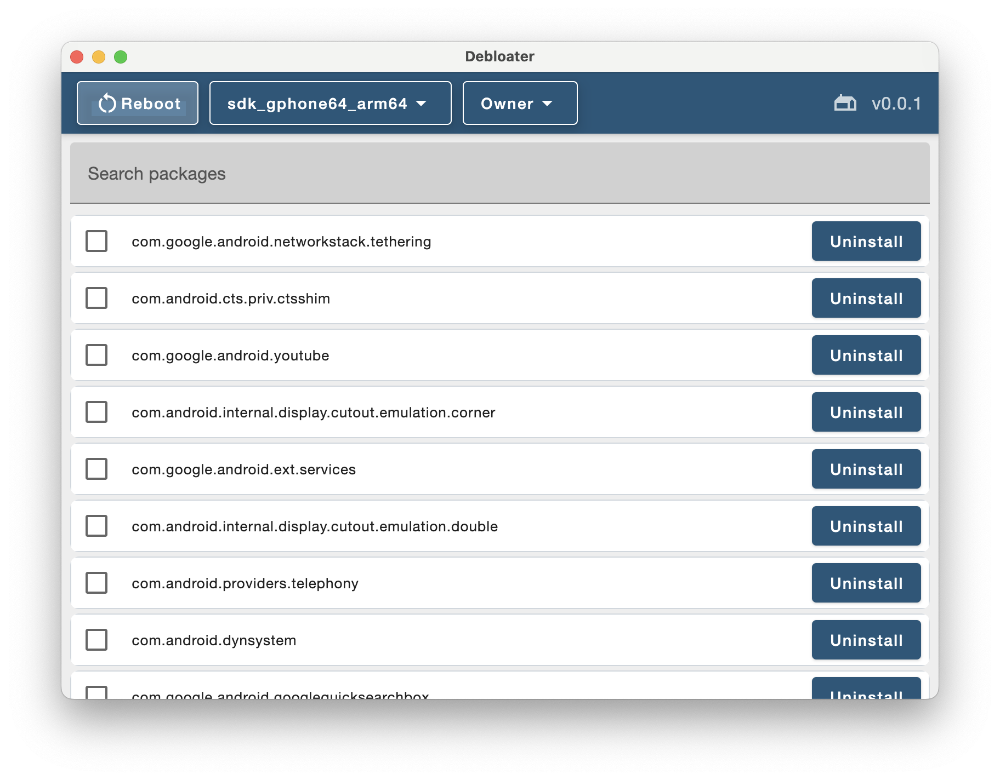

# Debloater App

## Introduction

Debloater is a robust Jetpack Compose based Android application that helps you manage the installed apps on your device. The app lists all the installed packages and provides an option to uninstall them directly from the interface. The application also includes a powerful filtering feature that allows you to search packages based on their names.

## Features

- **List Installed Applications:** Debloater fetches all the installed applications on your device and presents them in a neat list.
- **Uninstall Applications:** With just one tap on the uninstall button, you can remove any unnecessary or unwanted apps from your device.
- **Search Packages:** This feature allows you to filter applications based on their package names.
- **ADB Integration:** Debloater can reboot a selected device using ADB (Android Debug Bridge). It fetches the list of connected devices and you can select any device for reboot.
- **GitHub Link:** You can access the source code of the application directly from the app itself. There's a link that redirects you to the GitHub repository of the application.

## Installation

The application is available on GitHub. You can clone the repository and open it in Android Studio to build the app and install it on your device. Follow these steps:

1. Clone the repository using git. `git clone https://github.com/kl3jvi/Debloater.git`
2. Open Android Studio.
3. Click on 'Open an Existing Project'.
4. Browse to the directory where you cloned the Debloater app, and click OK.
5. Let Android Studio import the project and install all the necessary dependencies.
6. Once the project sync is complete, run the app by clicking on the 'Run' button(`Shift + F10`).

## Contribute

We would love for you to contribute to the project and help make it better! If you find a bug or have a feature request, please open an issue or submit a pull request.

## License

The application is released under the [MIT License](https://opensource.org/licenses/MIT).
